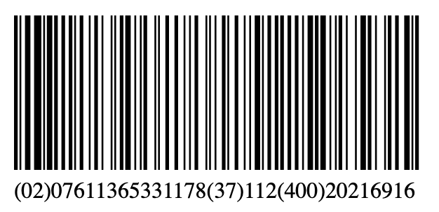

# barcodeCore
Barcode - parsing and drawing.

.NETStandard 2.0  
No external dependencies.

## Usage
``` C#
// get instance of specific barcode implementation 
var barcode = BarcodeFactory.Create(BarcodeTypes.Ean_128);

barcode.OnRenderBar = (bar) =>
{
    //  ** draw barcode element (black rectangle) using bar object: **
    //  bar.X 
    //  bar.Width 
};

barcode.Render("ThisIsAwesomeBarcode1234");
```
## Example
Drawing GS1-128 barcode as SVG
``` C#
var barcode = BarcodeFactory.Create(BarcodeTypes.Gs1_128);
var barcodeTxt = "(02)07611365331178(37)112(400)20216916";
var scale = 1.3;
var svg = string.Empty;

barcode.OnRenderBar = (bar) =>
{
    svg += $"<rect x='{bar.X * scale + 20}' y='20' height='110' width='{bar.Width * scale}' />{Environment.NewLine}";
};

barcode.Render(barcodeTxt);

svg = $@"<?xml version='1.0' ?>
         <svg xmlns='http://www.w3.org/2000/svg' xmlns:xlink= 'http://www.w3.org/1999/xlink' width='600' height='170'>
            {svg}
            <text x='20' y='150' >{barcodeTxt}</text>
         </svg>";

File.WriteAllText("barcodeTest.svg", svg);
```

## Currently supported barcodes:
* EAN 128 - CodeSet-B
* GS1-128 - CodeSet-C & CodeSet-B
